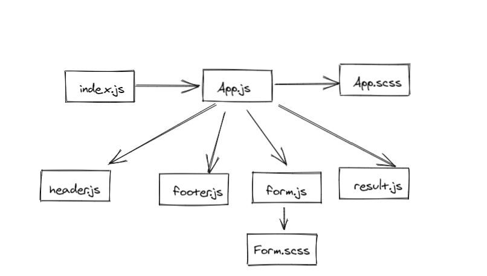

# resty

# Sandbox 

[Sandbox link](https://codesandbox.io/s/blissful-neumann-9pbky)

# PULL Request 

[PR](https://github.com/AseelAlasaad/resty/pull/1)

# UML

# RUN

npm run start

# resty lab27

# Sandbox 

[Sandbox link](https://codesandbox.io/s/hopeful-platform-yodwg?file=/src/App.js)

# PULL Request 

[PR](https://github.com/AseelAlasaad/resty/pull/5)
